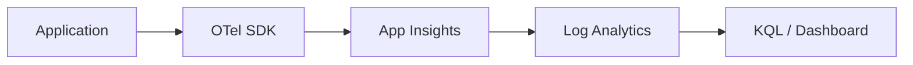

# Azure Infrastructure & Architecture Guide

이 문서는 다국어 텔레메트리 통합 시스템을 위해 필요한 Azure 인프라 구성 요소와 그 도입 배경을 정리한 가이드입니다.

## 1. 핵심 인프라 구성 요소 (Infrastructure Stack)

| 구성 요소   | 기술 명칭            | 주요 역할                         |
| :------ | :--------------- | :---------------------------- |
| 로그 저장소  | LAW              | 모든 서비스의 로그가 저장되는 데이터베이스       |
| 모니터링 포털 | App Insights     | 수집된 데이터를 분석하고 시각화하는 도구        |
| 서버 호스트  | VM               | 애플리케이션이 구동되는 실행 환경            |
| 보안 인증   | Managed Identity | 비밀번호 없이 리소스에 안전하게 접근하기 위한 신분증 |

---

## 2. 언어별 사용 라이브러리 (SDK Reference)

각 샘플 앱에서 사용 중인 핵심 라이브러리 목록입니다. 모두 **OpenTelemetry** 표준을 지원합니다.

- **Python**: `azure-monitor-opentelemetry`
- **Node.js**: `@azure/monitor-opentelemetry`
- **.NET (C#)**: `Azure.Monitor.OpenTelemetry.AspNetCore`
- **Java**: `applicationinsights-agent`

> [!NOTE]
> **Java는 왜 Agent를 쓰나요?** 
> `applicationinsights-agent`는 내부적으로 **OpenTelemetry Java Agent**를 기반으로 만들어진 Azure 전용 패키지입니다. 코드를 한 줄도 수정하지 않고도 가장 강력한 OpenTelemetry 기능을 사용할 수 있기 때문에 Java에서는 이 방식을 표준으로 권장합니다.

---

## 3. 도입 배경 및 기술적 가치 (Rationale)

### Managed Identity란 무엇인가요?

**Managed Identity(MI)**는 Azure가 가상머신(VM) 등에게 발급해주는 **"디지털 신분증"**입니다.

- **암호가 필요 없음**: 코드나 설정 파일에 비밀번호를 직접 적어두는 것은 보안상 매우 위험합니다.
- **인프라 레벨 자동화**: OS에 소프트웨어를 설치하는 것이 아니라, Azure 인프라(IMDS)가 VM에 "ID 토큰"을 직접 제공하는 방식입니다.
- **객체 바인딩 (보안 핵심)**: 이 신분증은 "코드"가 아니라 "그 VM" 자체에 묶여 있습니다.

> [!TIP]
> **입장의 차이 (중요!)**
> - **SSH**: "사용자(인간)"가 VM 내부로 들어가기 위한 통로 (보안을 위해 키 파일을 사용)
> - **Managed Identity**: "VM(애플리케이션)" 내부의 코드가 Azure 서비스에 접속하기 위한 통로 (암호 없음)

### Application Insights가 꼭 필요한 이유

단순 로그 저장소(LAW)에 비해 App Insights는 다음과 같은 **APM(애플리케이션 성능 관리)** 기능을 추가로 제공합니다.

- **분산 추적 (Distributed Tracing)**: 요청이 여러 서버를 거쳐갈 때 전체 경로를 한눈에 보여줍니다.
- **애플리케이션 맵**: 서비스 간의 연결 상태를 그림으로 시각화해 줍니다.
- **실시간 지표**: CPU, 메모리, 응답 속도 등을 실시간 대시보드로 즉시 확인할 수 있습니다.

### App Insights는 어떻게 분석을 하나요?

내부적으로 다음 3가지 핵심 메커니즘을 사용합니다.

1. **상관 관계 (Correlation)**: 모든 요청에 고유 ID를 부여하여, DB 호출이나 로그 등 연관된 모든 데이터를 하나로 묶습니다.
2. **지표 실시간 집계**: 수집된 데이터를 즉시 통계 처리하여 95th percentile 응답 시간 등을 계산합니다.
3. **KQL 기반 분석**: Underlying 엔진인 LAW를 Kusto Query Language(KQL)로 고속 스캔하여 결과를 도출합니다. (자동 ?????)

### 왜 최신 OpenTelemetry 표준을 쓰나요?

- Vendor Neutral: 나중에 모니터링 도구를 바꾸더라도 코드를 수정할 필요가 없습니다.
- 글로벌 표준: 전 세계적으로 통용되는 표준이라 호환성이 뛰어납니다.

---

## 4. 데이터 흐름도 (Architecture Flow)

---

## 5. 5W1H 로깅 정책의 가치

단순히 에러 정보만 찍는 것이 아니라, 아래 정보를 강제로 포함시켜 분석 효율을 높입니다.

- Who: 누가 접속했는가 (IP/ID)
- When: 언제 발생했는가 (자동 기록)
- Where: 어느 서버의 어느 API 경로인가
- What: 어떤 동작(Method)을 수행했는가
- Why: 왜 에러가 났는가 (Exception Trace)

이 정책을 통해 장애 원인을 3초 만에 찾아낼 수 있는 환경을 구축하는 것이 본 인프라의 최종 목적입니다.
